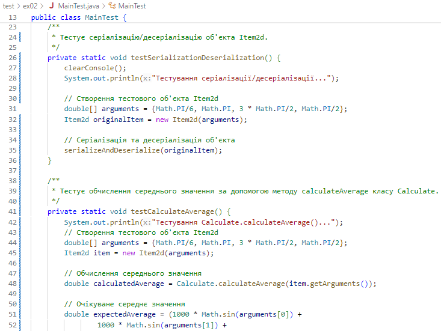

# Практика з ООП
## Завдання 2 - Класи та об'єкти  (01.04.24)
**Індивідуальне завдання №1:**  
Визначити кількість одиниць у двійковому поданні цілої частини середнього арифметичного значення функції 1000*sin(α) для чотирьох довільних аргументів.

Розробити клас, що серіалізується, для зберігання параметрів і результатів обчислень.

Використовуючи агрегування, розробити клас для знаходження рішення задачі.

Розробити клас для демонстрації в діалоговому режимі збереження та відновлення стану об'єкта, використовуючи серіалізацію. Показати особливості використання transient полів.

Розробити клас для тестування коректності результатів обчислень та серіалізації/десеріалізації.

Результат тестування:

## Завдання 1 (29.03.23)
 Написати просту консольну програму (наприклад вивід на екран аргументів командної строки)
