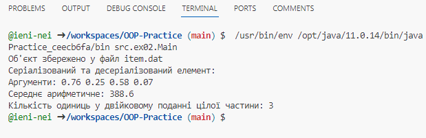
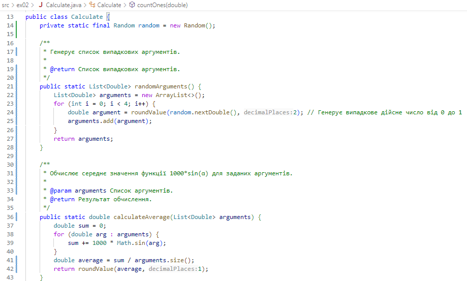

# Практика з ООП
## Завдання 3 - Спадкування (02.04.24)
Забезпечити розміщення результатів обчислень у колекції з можливістю збереження/відновлення.  
Використовуючи шаблон проектування Factory Method (Virtual Constructor), розробити ієрархію, що передбачає розширення рахунок додавання нових відображуваних класів.

Розширити ієрархію інтерфейсом "фабрикованих" об'єктів, що представляє набір методів для відображення результатів обчислень.

Реалізувати ці методи виведення результатів у текстовому виде.

Розробити та реалізувати інтерфейс для "фабрикуючого" методу.

## Завдання 2 - Класи та об'єкти  (01.04.24)
**Індивідуальне завдання №1:**  
Визначити кількість одиниць у двійковому поданні цілої частини середнього арифметичного значення функції 1000*sin(α) для чотирьох довільних аргументів.

Розробити клас, що серіалізується, для зберігання параметрів і результатів обчислень.

Використовуючи агрегування, розробити клас для знаходження рішення задачі.

Розробити клас для демонстрації в діалоговому режимі збереження та відновлення стану об'єкта, використовуючи серіалізацію. Показати особливості використання transient полів.

Розробити клас для тестування коректності результатів обчислень та серіалізації/десеріалізації.

Результат тестування:

## Завдання 1 (29.03.23)
 Написати просту консольну програму (наприклад вивід на екран аргументів командної строки)
