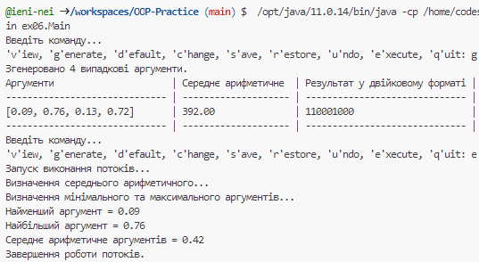
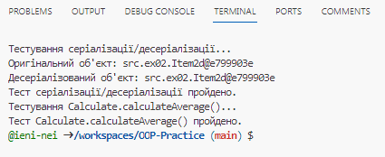
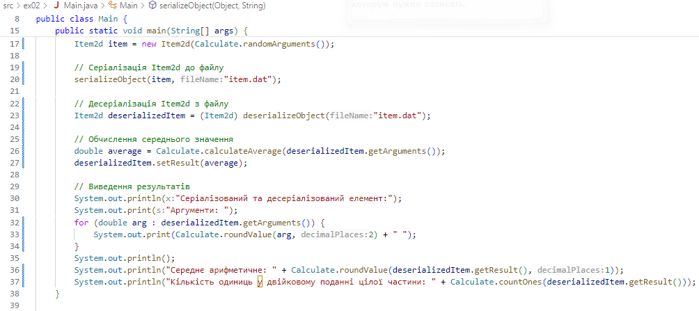

# Практика з ООП
### **Навігація**
| Завдання та зображення                                 |      Коди       |       Тести       |
| :----------------------------------------------------- | :-------------: | :---------------: |
| [Завдання 7](#завдання-7---діалоговий-інтерфейс080424) | [Код](src/ex07) |         —         |
| [Завдання 6](#завдання-6---паралельне-виконання050424) | [Код](src/ex06) | [Тест](test/ex06) |
| [Завдання 5](#завдання-5---обробка-колекцій-040424)    | [Код](src/ex05) | [Тест](test/ex05) |
| [Завдання 4](#завдання-4---поліморфізм-030424)         | [Код](src/ex04) | [Тест](test/ex04) |
| [Завдання 3](#завдання-3---спадкування-020424)         | [Код](src/ex03) | [Тест](test/ex03) |
| [Завдання 2](#завдання-2---класи-та-обєкти-010424)     | [Код](src/ex02) | [Тест](test/ex02) |
| [Завдання 1 (вступне)](#завдання-1-290323)             | [Код](src/ex01) | [Тест](test/ex01) |

## Завдання 7 - Діалоговий інтерфейс.(08.04.24) 
Розробити ієрархію класів відповідно до шаблону Observer (java) та продемонструвати можливість обслуговування розробленої раніше колекції (об'єкт, що спостерігається, Observable) різними (не менше двох) спостерігачами (Observers) – відстеження змін, упорядкування, висновок, відображення і т.д.<br>

При реалізації ієрархії класів використати інструкції (Annotation). Відзначити особливості різних політик утримання анотацій (annotation retention policies). Продемонструвати підтримку класів концепції рефлексії (Reflection).<br>

Використовуючи раніше створені класи, розробити додаток, що відображає результати обробки колекції об'єктів у графічному вигляді. <br>

Забезпечити діалоговий інтерфейс з користувачем та перемальовування графіка під час зміни значень елементів колекції.<br>

`Результат:`<br>


`Main.java`:
```java
package ex07;

/**
 * Головний клас.
 */
public class Main {
	public static void main(String[] args) {
		new App();
	}
}

```

`App.java`:
```java
package ex07;

import ex02.Item2d;
import ex02.Calculate;
import ex05.History;

import javax.swing.*;
import javax.swing.table.DefaultTableModel;
import java.io.IOException;

/**
 * Реалізує шаблон Observer.
 */
public class App extends JFrame {
    private static final History history = History.getInstance();
    private final ObservableViewTable view = new ObservableViewTable();

    private JPanel panel;
    private JTable table;
    private JLabel label;
    private JButton initButton;
    private JButton defaultButton;
    private JButton saveButton;
    private JButton restoreButton;
    private JButton undoButton;

    public App() {
        initializeUI();
        initializeListeners();
        registerObservers();
    }

    private void initializeUI() {
        setContentPane(panel);
        setSize(800, 300);
        setVisible(true);

        createTable();
    }

    private void initializeListeners() {
        initButton.addActionListener(e -> {
            history.add(view.getItems());
            view.init();
            label.setText("Генерація даних...");
            updateTable();
        });

        defaultButton.addActionListener(e -> {
            history.add(view.getItems());
            view.initDefault();
            label.setText("Застосування статичних даних...");
            updateTable();
        });

        saveButton.addActionListener(e -> {
            try {
                view.save("temp/Task-7/item.dat");
                label.setText("Збереження даних...");
            } catch (IOException ex) {
                throw new RuntimeException(ex);
            }
            updateTable();
        });

        restoreButton.addActionListener(e -> {
            try {
                view.restore("temp/Task-7/item.dat");
                label.setText("Відновлення даних...");
            } catch (IOException | ClassNotFoundException ex) {
                throw new RuntimeException(ex);
            }
            updateTable();
        });

        undoButton.addActionListener(e -> {
            History.undo(view);
            label.setText("Скасування операції...");
            updateTable();
        });
    }

    private void registerObservers() {
        view.register(new SaveObserver());
        view.register(new InitObserver());
        view.register(new UndoObserver());
    }

    /** Створює пусту таблицю при запуску програми */
    private void createTable() {
        table.setModel(new DefaultTableModel(
                new Object[][]{},
                new String[]{"Аргументи", "Середнє арифметичне", "Двійкове", "К-ть одиниць"}
        ));
    }

    /**
     * Оновлює дані в таблиці
     */
    public void updateTable() {
        Object[][] values = new Object[view.getItems().size()][4];

        for (int i = 0; i < values.length; i++) {
            Item2d items = view.getItems().get(i);
            values[i][0] = items.getArguments();
            values[i][1] = items.getResult();
            values[i][2] = Calculate.toBinaryString(items.getResult());
            values[i][3] = Calculate.countOnes(items.getResult());
        }

        table.setModel(new DefaultTableModel(values,
                new String[]{"Аргументи", "Середнє арифметичне", "Двійкове", "К-ть одиниць"}));
    }

    public static void main(String[] args) {
        SwingUtilities.invokeLater(App::new);
    }
}

```

`ObservableViewTable.java`:
```java
package ex07;

import ex04.View_Table;

import java.io.IOException;
import java.util.ArrayList;

/**
 * Спостерігаємоий клас на основі View_Table.
 * Реалізацію шаблону Observer.
 */
public class ObservableViewTable extends View_Table implements Observable {
    private final ArrayList<Observer> observers = new ArrayList<>();

    /**
     * Додає спостерігача
     */
    @Override
    public void register(Observer observer) {
        observers.add(observer);
    }

    /**
     * Оповіщає всіх спостерігачів
     */
    @Override
    public void notify(String type, String message) {
        for (Observer observer : observers) {
            observer.notify(type, message);
        }
    }

    // Відправляє повідомлення про генерацію випадкових даних
    @Override
    public void init() {
        notify(
                "генерація",
                "Викликана випадкова генерація даних."
        );

        super.init();
    }

    // Відправляє повідомлення про генерацію статичних даних
    @Override
    public void initDefault() {
        notify(
                "генерація",
                "Викликана статична генерація даних."
        );

        super.initDefault();
    }

    // Відправляє повідомлення про серіалізацію
    @Override
    public void save(String path) throws IOException {
        notify("серіалізація", "Викликана серіалізація");
        super.save(path);
    }

    // Відправляє повідомлення про десеріалізацію
    @Override
    public void restore(String path) throws IOException, ClassNotFoundException {
        notify("десеріалізація", "Викликана десеріалізація");
        super.restore(path);
    }
}

```

[До початку](#практика-з-ооп)

## Завдання 6 - Паралельне виконання.(05.04.24)
Продемонструвати можливість паралельної обробки елементів колекції (пошук мінімуму, максимуму, обчислення середнього значення, відбір за критерієм, статистична обробка тощо).<br>

Управління чергою завдань (команд) реалізувати за допомогою шаблону Worker Thread.<br>

`Результат:`<br>


`Результат тестування:`<br>


`Main.java`:
```java
package ex06;

import ex03.View;
import ex04.Viewable_Table;
import ex05.*;

/**
 * Клас для запуску головного модуля програми.
 */
public class Main {

    /** Представлення для відображення даних. */
    private View view = new Viewable_Table().getView();

    /** Меню для взаємодії з користувачем. */
    private Menu menu = new Menu();

    /**
     * Запускає головний модуль програми.
     */
    public void run() {
        menu.add(new ViewConsoleCommand(view));
        menu.add(new GenerateConsoleCommand(view));
        menu.add(new DefaultConsoleCommand(view));
        menu.add(new ChangeConsoleCommand(view));
        menu.add(new SaveConsoleCommand(view));
        menu.add(new RestoreConsoleCommand(view));
        menu.add(new UndoConsoleCommand(view));
        menu.add(new ExecuteConsoleCommand(view));
        menu.execute();
    }

    /**
     * Точка входу у програму.
     *
     * @param args аргументи командного рядка
     */
    public static void main(String[] args) {
        Main main = new Main();
        main.run();
    }
}

```

`CommandQueue.java`:
```java
package ex06;

import ex05.Command;

import java.util.LinkedList;
import java.util.Queue;

/**
 * Клас, що реалізує чергу команд.
 */
public class CommandQueue {

    private final Queue<Command> tasks;
    private boolean shutdown = false;

    /**
     * Закриває чергу команд.
     */
    public synchronized void shutdown() {
        this.shutdown = true;
        notifyAll();
    }

    /**
     * Конструктор класу CommandQueue.
     */
    public CommandQueue() {
        tasks = new LinkedList<>();
    }

    /**
     * Додає команду до черги.
     *
     * @param command Команда, яку потрібно додати до черги.
     */
    public synchronized void put(Command command) {
        tasks.add(command);
        notifyAll();
    }

    /**
     * Повертає та видаляє команду з черги.
     *
     * @return Команда, що вийшла з черги.
     * @throws InterruptedException Виникає, якщо виникає помилка під час очікування команди у черзі.
     */
    public synchronized Command take() throws InterruptedException {
        while (tasks.isEmpty() && !shutdown) {
            wait();
        }
        return tasks.poll();
    }
}

```

`ExecuteConsoleCommand.java`:
```java
package ex06;

import ex03.View;
import ex05.ConsoleCommand;

import java.util.concurrent.ExecutorService;
import java.util.concurrent.Executors;
import java.util.concurrent.TimeUnit;

/**
 * Команда для виконання інших команд у відокремленому потоці.
 * Забезпечує виконання переданих команд у відокремленому потоці, використовуючи ExecutorService.
 */
public class ExecuteConsoleCommand implements ConsoleCommand {

    private View view;

    /**
     * Конструктор, що ініціалізує об'єкт класу ExecuteConsoleCommand з переданим інтерфейсом View.
     *
     * @param view інтерфейс для відображення результатів обчислень
     */
    public ExecuteConsoleCommand(View view) {
        this.view = view;
    }

    @Override
    public char getKey() {
        return 'e';
    }

    @Override
    public String toString() {
        return "'e'xecute";
    }

    @Override
    public void execute() {
        System.out.println("Запуск виконання потоків...");

        // Створення ExecutorService з двома потоками
        ExecutorService executorService = Executors.newFixedThreadPool(2);

        // Подання команд до сервісу виконання
        executorService.submit(() -> {
            new AvgCommand(view).execute();
        });

        executorService.submit(() -> {
            new MinMaxCommand(view).execute();
        });

        // Зупинка сервісу виконання
        executorService.shutdown();

        // Очікування завершення виконання всіх команд
        try {
            executorService.awaitTermination(Long.MAX_VALUE, TimeUnit.NANOSECONDS);
        } catch (InterruptedException e) {
            Thread.currentThread().interrupt();
        }

        executorService.shutdown();

        System.out.println("Завершення роботи потоків.");
    }
}

```

`MainTest.java`:
```java
package test.ex06;

import ex03.View;
import ex04.Viewable_Table;
import ex06.ExecuteConsoleCommand;

import java.io.ByteArrayOutputStream;
import java.io.PrintStream;

/**
 * Клас для тестування виконання команд з консолі.
 */
public class MainTest {
    /**
     * Точка входу в програму для тестування.
     *
     * @param args аргументи командного рядка (не використовуються).
     * @throws Exception якщо виникає помилка під час виконання тесту.
     */
    public static void main(String[] args) throws Exception {
        MainTest test = new MainTest();
        test.setUpStreams();
        test.testExecute();
        test.restoreStreams();
    }
    
    private final ByteArrayOutputStream outContent = new ByteArrayOutputStream();
    private final PrintStream originalOut = System.out;

    /**
     * Налаштування перехоплення виведення в консоль.
     */
    public void setUpStreams() {
        System.setOut(new PrintStream(outContent));
    }

    /**
     * Відновлення оригінального виведення в консоль.
     */
    public void restoreStreams() {
        System.setOut(originalOut);
        System.out.println(outContent.toString()); // Вивід перехопленого виведення
    }

    /**
     * Тестування виконання команд.
     *
     * @throws Exception якщо виникає помилка під час виконання тесту.
     */
    public void testExecute() throws Exception {
        View view = new Viewable_Table().getView();

        view.init();

        ExecuteConsoleCommand executeConsoleCommand = new ExecuteConsoleCommand(view);

        executeConsoleCommand.execute();

        String output = outContent.toString().trim();

        // Перевірка виведених результатів наявності необхідних рядків
        assert (output.contains("Середнє арифметичне аргументів = "));
        assert (output.contains("Найменший аргумент = "));
        assert (output.contains("Найбільший аргумент = "));
    }
}

```

[До початку](#практика-з-ооп)

## Завдання 5 - Обробка колекцій (04.04.24)
Реалізувати можливість скасування (undo) операцій (команд).<br>

Продемонструвати поняття "макрокоманда".<br>

При розробці програми використовувати шаблон Singletone.<br>

Забезпечити діалоговий інтерфейс із користувачем.<br>

Розробити клас для тестування функціональності програми.<br>

`Результат:`


https://github.com/ieni-nei/OOP-Practice/assets/113203792/5c3cf089-0a20-477e-8b7b-1a0b54448e18


`Результат тестування:`<br>


`Main.java`:
```java
package src.ex05;

/**Обчислення та відображення результатів
 * Містить реалізацію статичного методу main()
 *
 * @author @ieni-nei
 */
public class Main {
    
    public static void main(String[] args){
        Application app = Application.getInstance();
        app.run();
    }
}

```

`MainTest.java`:
```java
package test.ex05;

import ex02.Item2d;
import ex05.ChangeItemCommand;

import java.util.ArrayList;
import java.util.List;

/**
 * Клас для тестування класу ChangeItemCommand.
 */
public class MainTest {

    /**
     * Головний метод програми.
     *
     * @param args аргументи командного рядка
     */
    public static void main(String[] args) {
        testChangeItemCommand();
    }

    /**
     * Метод для тестування зміни елемента.
     */
    private static void testChangeItemCommand() {
        System.out.println("Тестування ChangeItemCommand...");
        List<Double> initialArguments = new ArrayList<>();
        initialArguments.add(1.0);
        initialArguments.add(2.0);
        initialArguments.add(3.0);

        Item2d item = new Item2d(initialArguments);

        ChangeItemCommand command = new ChangeItemCommand(item);

        System.out.println("Початкові аргументи елемента: " + item.getArguments());

        command.execute();

        System.out.println("Змінені аргументи елемента: " + item.getArguments());
    }
}

```

`Application.java`:
```java
package src.ex05;

import src.ex03.View;
import src.ex04.Viewable_Table;

/**
 * Формує та відображає меню
 * 
 * Реалізує шаблон Singleton
 */
public class Application {

    private static final Application instance = new Application();

    private Application() {}

    public static Application getInstance() {
        return instance;
    }

    private final View view = new Viewable_Table().getView();

    private final Menu menu = new Menu();

    public void run() {
        menu.add(new ViewConsoleCommand(view));
        menu.add(new GenerateConsoleCommand(view));
        menu.add(new ChangeConsoleCommand(view));
        menu.add(new SaveConsoleCommand(view));
        menu.add(new RestoreConsoleCommand(view));
        menu.add(new UndoConsoleCommand(view));
        menu.execute();
    }
}

```

`Menu.java`:
```java
package src.ex05;

import java.io.BufferedReader;
import java.io.IOException;
import java.io.InputStreamReader;
import java.util.ArrayList;
import java.util.List;

/**Макрокоманда Pattern Command
 * 
 * Колекція об'єктів класу ConsoleCommand
 */
public class Menu implements Command {

    private List<ConsoleCommand> menu = new ArrayList<ConsoleCommand>();

    public ConsoleCommand add(ConsoleCommand command){
        menu.add(command);
        return command;
    }
    
    @Override
    public String toString(){
        String s = "Введіть команду...\n";
        for(ConsoleCommand c : menu){
            s += c + ", ";
        }
        s += "'q'uit: ";
        return s;
    }
    
    @Override
    public void execute() {
        String s = null;
        BufferedReader in = new BufferedReader(new InputStreamReader(System.in));
        menu:
        while (true) {
            do {
                System.out.print(this);
                try {
                    s = in.readLine();
                } catch (IOException e) {
                    System.err.println("Помилка: " + e);
                    System.exit(0);
                }
            } while (s.length() != 1);
            char key = s.charAt(0);
            if (key == 'q') {
                System.out.println("Вихід.");
                System.exit(0);
            }
            for (ConsoleCommand c : menu) {
                if (s.charAt(0) == c.getKey()) {
                    c.execute();
                    continue menu;
                }
            }
            System.out.println("Неправильна команда.");
            continue menu;
        }
    }

    /**
     * Повертає список команд меню.
     *
     * @return Список команд меню.
     */
    public List<ConsoleCommand> getCommands() {
        return menu;
    }
}

```

[До початку](#практика-з-ооп)

## Завдання 4 - Поліморфізм (03.04.24)
Використовуючи шаблон проектування Factory Method (Virtual Constructor), розширити ієрархію похідними класами, що реалізують методи для подання результатів у вигляді текстової таблиці. Параметри відображення таблиці мають визначатися користувачем.<br>

Продемонструвати заміщення (перевизначення, overriding), поєднання (перевантаження, overloading), динамічне призначення методів (Пізнє зв'язування, поліморфізм, dynamic method dispatch).<br>

Забезпечити діалоговий інтерфейс із користувачем.<br>

Розробити клас для тестування основної функціональності.<br>

`Результат:`


https://github.com/ieni-nei/OOP-Practice/assets/113203792/9d9678ca-b8b6-411a-a915-d8f2ca1e2811


`Результат тестування:`<br>


`Main.java`:
```java
package src.ex04;

import src.ex03.View;

import java.io.File;
import java.util.NoSuchElementException;
import java.util.Scanner;

/**
 * Клас для демонстрації збереження та відновлення стану об'єкта з використанням серіалізації.
 * 
 * @author @ieni-nei
 */
public class Main {
    /**
     * Головний метод програми.
     *
     * @param args Аргументи командного рядка.
     */
    public static void main(String[] args) {
        Scanner scanner = new Scanner(System.in);
        View view = new Viewable_Table().getView();

        // Очистити консоль
        System.out.print("\033[H\033[2J");
        System.out.flush();

        while (true) {
            System.out.println("Оберіть дію:");
            System.out.println("1. Ввести чотири довільні аргументи");
            System.out.println("2. Використати аргументи за замовчуванням");
            System.out.println("3. Показати результати");
            System.out.println("4. Зберегти результати у файл");
            System.out.println("5. Відновити результати з файлу");
            System.out.println("6. Вийти");
            System.out.print("Введіть номер дії: ");

            try {
                int choice = scanner.nextInt();
                scanner.nextLine();

                switch (choice) {
                    case 1:
                        view.init();
                        break;
                    case 2:
                        view.initDefault();
                        break;
                    case 3:
                        view.show();
                        break;
                    case 4:
                        view.save("temp/Task-4/item.dat");
                        break;
                    case 5:
                        File file = new File("temp/Task-4/item.dat");
                        if (file.exists()) {
                            view.restore("temp/Task-4/item.dat");
                        } else {
                            System.out.println("Спочатку збережіть результати у файл.");
                        }
                        break;
                    case 6:
                        scanner.close();
                        System.exit(0);
                        break;
                    default:
                        System.out.println("Невірний вибір, введіть номер дії зі списку.");
                        break;
                }
            } catch (NoSuchElementException e) {
                System.out.println("Невірний ввід, введіть ціле число.");
                scanner.nextLine(); // Consume invalid input
            } catch (Exception e) {
                e.printStackTrace();
            }
        }
    }
}

```

`View_Table.java`:
```java
package src.ex04;

import java.util.List;

import src.ex02.Calculate;
import src.ex02.Item2d;
import src.ex03.View_Result;

/**
 * Клас для відображення результатів у вигляді таблиці.
 * 
 * @author @ieni-nei
 */
public class View_Table extends View_Result {

    /**
     * Конструктор за замовчуванням.
     */
    public View_Table() {
        super();
    }

    /**
     * Показує таблицю з результатами.
     */
    @Override
    public void show() {
        header();
        separator();
        body();
        separator();
    }

    /**
     * Виводить заголовок таблиці.
     */
    @Override
    public void header() {
        System.out.printf("%-30s | %-20s | %-30s | %-50s\n", "Аргументи", "Середнє арифметичне", "Результат у двійковому форматі", "Кількість одиниць у двійковому поданні цілої частини");
    }

    /**
     * Виводить роздільник таблиці.
     */
    public void separator() {
        System.out.println("-".repeat(30) + " | " + "-".repeat(20) + " | " + "-".repeat(30) + " | " + "-".repeat(50));
    }

    /**
     * Виводить тіло таблиці з даними.
     */
    @Override
    public void body() {
        List<Item2d> items = getItems();
        for (int i = 0; i < items.size(); i++) {
            Item2d item = items.get(i);
            System.out.printf("%-30s | %-20.2f | %-30s | %-50d\n", item.getArguments(), item.getResult(), Calculate.toBinaryString(item.getResult()), Calculate.countOnes(item.getResult()));
        }
    }
}

```

`Viewable_Table.java`:
```java
package src.ex04;

import src.ex03.View;
import src.ex03.Viewable_Result;

/**
 * Клас, що реалізує інтерфейс Viewable_Result для створення об'єктів типу View_Table.
 */
public class Viewable_Table extends Viewable_Result {
    
    /**
     * Повертає новий об'єкт типу View_Table.
     *
     * @return Об'єкт типу View_Table.
     */
    @Override
    public View getView() {
        return new View_Table();
    }
}

```

`MainTest.java`:
```java
package test.ex04;

import src.ex04.View_Table;

import java.io.IOException;

/**
 * Клас для тестування основної функціональності.
 */
public class MainTest {
    /**
     * Головний метод для тестування основної функціональності.
     *
     * @param args Аргументи командного рядка (не використовуються в цій програмі).
     */
    public static void main(String[] args) {
        View_Table view = new View_Table();

        // Тестування ініціалізації
        System.out.println("Тестування ініціалізації:");
        view.init();
        view.show();

        // Тестування збереження та відновлення
        System.out.println("\nТестування збереження та відновлення:");
        try {
            view.save("temp/Task-4/test_item.dat");
            view.restore("temp/Task-4/test_item.dat");
            view.show();
        } catch (IOException | ClassNotFoundException e) {
            e.printStackTrace();
        }
    }
}

```

[До початку](#практика-з-ооп)

## Завдання 3 - Спадкування (02.04.24)
Забезпечити розміщення результатів обчислень у колекції з можливістю збереження/відновлення.<br>

Використовуючи шаблон проектування Factory Method (Virtual Constructor), розробити ієрархію, що передбачає розширення за рахунок додавання нових відображуваних класів.<br>

Розширити ієрархію інтерфейсом "фабрикованих" об'єктів, що представляє набір методів для відображення результатів обчислень.<br>

Реалізувати ці методи виведенням результатів у текстовому виді.<br>

Розробити та реалізувати інтерфейс для "фабрикуючого" методу.<br>

`Результат:`


https://github.com/ieni-nei/OOP-Practice/assets/113203792/0cc35245-c4e1-4c48-a9ec-6acfae7b3155


`Результат тестування:`<br>


`Main.java`:
```java
package src.ex03;

import java.io.File;
import java.util.NoSuchElementException;
import java.util.Scanner;

/**
 * Клас для демонстрації збереження та відновлення стану об'єкта з використанням серіалізації.
 * 
 * @author @ieni-nei
 */
public class Main {
    /**
     * Головний метод програми.
     *
     * @param args Аргументи командного рядка.
     */
    public static void main(String[] args) {
        Scanner scanner = new Scanner(System.in);
        View_Result view = new View_Result();

        // Очистити консоль
        System.out.print("\033[H\033[2J");
        System.out.flush();

        while (true) {
            System.out.println("Оберіть дію:");
            System.out.println("1. Ввести чотири довільні аргументи");
            System.out.println("2. Використати аргументи за замовчуванням");
            System.out.println("3. Показати результати");
            System.out.println("4. Зберегти результати у файл");
            System.out.println("5. Відновити результати з файлу");
            System.out.println("6. Вийти");
            System.out.print("Введіть номер дії: ");

            try {
                int choice = scanner.nextInt();
                scanner.nextLine();

                switch (choice) {
                    case 1:
                        view.init();
                        break;
                    case 2:
                        view.initDefault();
                        break;
                    case 3:
                        view.show();
                        break;
                    case 4:
                        view.save("temp/Task-3/item.dat");
                        break;
                    case 5:
                        File file = new File("temp/Task-3/item.dat");
                        if (file.exists()) {
                            view.restore("temp/Task-3/item.dat");
                        } else {
                            System.out.println("Спочатку збережіть результати у файл.");
                        }
                        break;
                    case 6:
                        scanner.close();
                        System.exit(0);
                        break;
                    default:
                        System.out.println("Невірний вибір, введіть номер дії зі списку.");
                        break;
                }
            } catch (NoSuchElementException e) {
                System.out.println("Невірний ввід, введіть ціле число.");
                scanner.nextLine(); // Consume invalid input
            } catch (Exception e) {
                e.printStackTrace();
            }
        }
    }
}

```

`View_Result.java`:
```java
package src.ex03;

import src.ex02.Calculate;
import src.ex02.Item2d;

import java.io.*;
import java.util.ArrayList;
import java.util.List;

/**
 * Клас для відображення результатів обчислень.
 * 
 * @author @ieni-nei
 */
public class View_Result implements View {
    private final List<Item2d> items = new ArrayList<>();

    /**
     * Виводить результат.
     */
    @Override
    public void show() {
        header();
        body();
        footer();
    }

    /**
     * Виводить заголовок.
     */
    public void header() {
        System.out.println("========Результати обчислень========");
    }

    /**
     * Виводить тіло.
     */
    public void body() {
        for (Item2d item : items) {
            System.out.println("Аргументи: " + item.getArguments());
            double average = item.getResult();
            System.out.println("Середнє арифметичне: " + average);
            System.out.println("Результат у двійковому форматі: " + Calculate.toBinaryString(average));
            System.out.println("Кількість одиниць у двійковому поданні цілої частини: " + Calculate.countOnes(average));
        }
    }

    /**
     * Виводить підвал.
     */
    public void footer() {
        System.out.println("===================================");
    }

    /**
     * Ініціалізує результати згенерованими значеннями.
     */
    @Override
    public void init() {
        items.clear();
        List<Double> arguments = Calculate.randomArguments();
        double average = Calculate.calculateAverage(arguments);
        items.add(new Item2d(arguments, average));
        System.out.println("Згенеровано 4 довільних аргументи");
    }

    /**
     * Ініціалізує результати зі стандартними значеннями.
     */
    @Override
    public void initDefault() {
        items.clear();
        double[] defaultArguments = {Math.PI / 6, Math.PI, 3 * Math.PI / 2, Math.PI / 2};
        List<Double> arguments = new ArrayList<>();
        for (double argument : defaultArguments) {
            arguments.add(Calculate.roundValue(argument, 2));
        }
        double average = Calculate.calculateAverage(arguments);
        items.add(new Item2d(arguments, average));
        System.out.println("Обрано 4 статичних аргументи");
    }


    /**
     * Зберігає результати у файл за вказаним шляхом.
     *
     * @param path Шлях до файлу.
     * @throws IOException Виникає, якщо виникає помилка при збереженні даних у файл.
     */
    @Override
    public void save(String path) throws IOException {
        try (ObjectOutputStream objectOut = new ObjectOutputStream(new FileOutputStream(path))) {
            objectOut.writeObject(items);
            System.out.println("Об'єкти збережено у файл " + path);
        }
    }

    /**
     * Відновлює раніше збережені результати з вказаного шляху.
     *
     * @param path Шлях до файлу збереження.
     * @throws IOException            Виникає, якщо виникає помилка при відновленні даних з файлу.
     * @throws ClassNotFoundException Виникає, якщо не вдається знайти клас під час відновлення даних з файлу.
     */
    @Override
    @SuppressWarnings("unchecked")
    public void restore(String path) throws IOException, ClassNotFoundException {
        try (ObjectInputStream objectIn = new ObjectInputStream(new FileInputStream(path))) {
            items.clear();
            items.addAll((ArrayList<Item2d>) objectIn.readObject());
            System.out.println("Об'єкти відновлено з файлу " + path);
        }
    }
}

```

`View.java`:
```java
package src.ex03;

import java.io.IOException;

/**
 * Інтерфейс для відображення результатів обчислень.
 * 
 * @author @ieni-nei
 */
interface View {
    /**
     * Показує весь об'єкт.
     */
    void show();

    /**
     * Показує заголовок.
     */
    void header();

    /**
     * Показує основну частину.
     */
    void body();

    /**
     * Показує колонтитул.
     */
    void footer();

    /**
     * Виконує ініціалізацію.
     */
    void init();

    /**
     * Виконує ініціалізацію за замовчуванням.
     */
    void initDefault();

    /**
     * Зберігає дані у файл за вказаним шляхом.
     *
     * @param path Шлях до файлу.
     * @throws IOException Виникає, якщо виникає помилка при збереженні даних у файл.
     */
    void save(String path) throws IOException;

    /**
     * Відновлює раніше збережені дані з вказаного шляху.
     *
     * @param path Шлях до файлу збереження.
     * @throws Exception Виникає, якщо виникає помилка при відновленні даних з файлу.
     */
    void restore(String path) throws Exception;
}

```

[До початку](#практика-з-ооп)

## Завдання 2 - Класи та об'єкти (01.04.24)
**Індивідуальне завдання №1:**</br>
Визначити кількість одиниць у двійковому поданні цілої частини середнього арифметичного значення функції 1000*sin(α) для чотирьох довільних аргументів.<br>


Результат тестування:<br>


Розробити клас, що серіалізується, для зберігання параметрів і результатів обчислень.<br>


Використовуючи агрегування, розробити клас для знаходження рішення задачі.<br>


Розробити клас для демонстрації в діалоговому режимі збереження та відновлення стану об'єкта, використовуючи серіалізацію. Показати особливості використання transient полів.<br>


Розробити клас для тестування коректності результатів обчислень та серіалізації/десеріалізації.<br>


[До початку](#практика-з-ооп)

## Завдання 1 (29.03.23)
 Написати просту консольну програму (наприклад вивід на екран аргументів командної строки).<br>


`Результат тестування:`<br>


`MainTest.java`:
```java
package test.ex01;

import ex01.Main;

public class MainTest {

    public static void main(String[] args) throws Exception {
        String[] arguments = {"Hello", "World", "011010"};

        // Перевірка виводу
        Main.main(arguments);
    }
}

```
